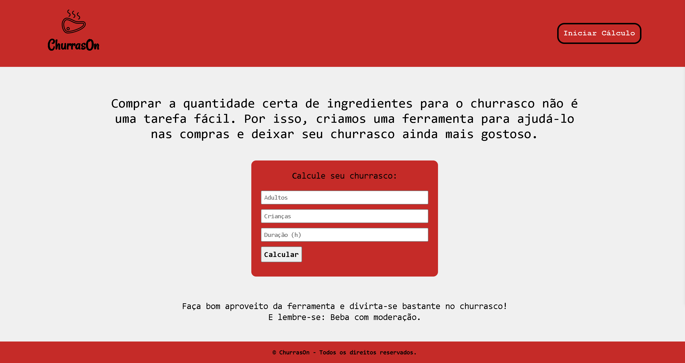
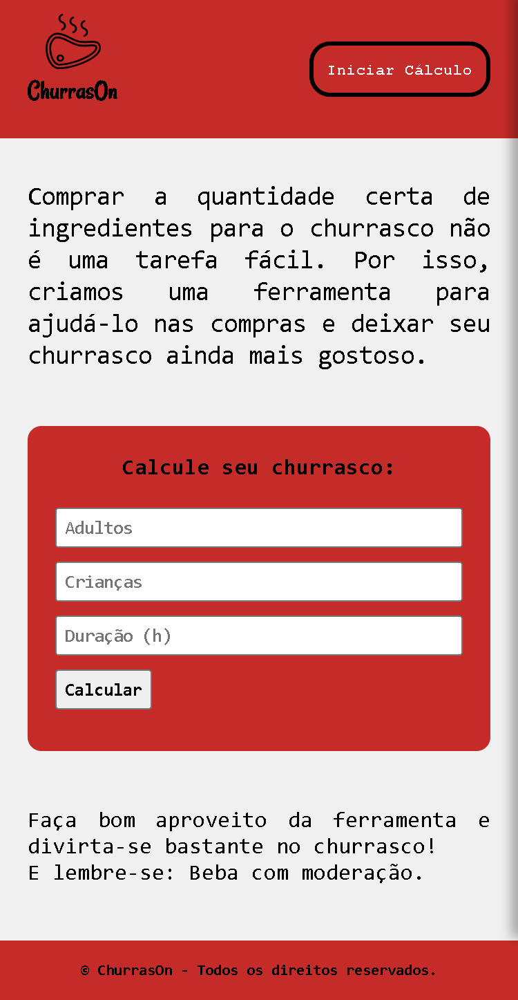

<h1>Cálculo De Churrasco</h1>

Projeto do curso Desenvolvimento Web - Igor Oliveira (Programador BR). 
Apesar da ideia inicial ser do curso para colocar em prática todo o conhecimento em JavaScript aprendidos até aquele momento, eu desenvolvi tudo diferente do que foi mostrado na vídeo-aula! Toda parte visual e todo código JavaScript por trás, foi desenvolvido por mim para uma melhor prática e para meu entendimento se realmente eu aprendi o que foi ensinado!

<nav>
    <a href="#desktop">Desktop</a>
    <a href="#mobile">Mobile</a>
    <a href="https://churrascometro-ten.vercel.app/" target="_blank">Projeto</a>
    <a href="#tecnologias">Tecnologias</a>
</nav>

<h2 id="desktop">Desktop</h2>

<h2 id="mobile">Mobile</h2>

<a href="https://churrascometro-ten.vercel.app/" target="_blank">
    <button>Ver Projeto</button></a>

<h2 id="tecnologias">Tecnologias</h2>
<ul>
  <li>HTML5</li>
  <li>CSS3</li>
  <li>JavaScript</li>
</ul>

<h4>
  Feito por <a href="https://www.linkedin.com/in/jrmartinsg/" target="_blank">jrmartinsg</a>
</h4>